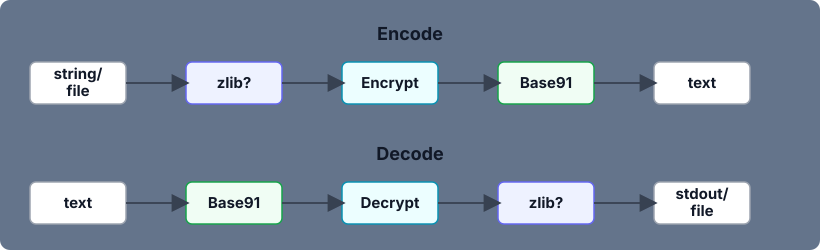

# text-serdes

Tiny daily-key text transport for copy/paste workflows.

`text-serdes` takes bytes from a file or stdin, compresses them with zlib, encrypts them with an AES-GCM key derived from today's local date, Base91-encodes the result, and prints one copyable line.

It is built for short-lived engineering text: Python error messages, logs, paths, JSON/YAML/TOML fragments, shell commands, tracebacks, and other structured text that does not behave like long prose.

## Install

```bash
uv sync
```

Or install it as a `uv` tool from this checkout:

```bash
uv tool install .
```

## Use

Encode stdin:

```bash
printf 'TypeError: invalid literal for int()' | uv run enc
```

Decode stdin:

```bash
uv run enc message.txt | uv run dec
```

Encode a file:

```bash
uv run enc message.txt
```

Decode a file containing encoded text:

```bash
uv run dec encoded.txt
```

Both commands use one optional positional file. With no file, they read stdin until EOF. `enc` writes a newline-terminated encoded string. `dec` writes the original bytes to stdout.

When `enc` receives a filename, it embeds only that file's basename. When `dec` sees an embedded filename, it writes the decoded bytes back to that basename in the current directory, overwriting any existing file.

## Format

Current payloads use:

- a `DC1` version marker
- a random 12-byte value needed for encryption
- encrypted zlib-compressed bytes
- optional basename metadata when encoding a file
- Base91 text output



## Security Model

This is not long-term secure storage.

The encryption key is:

```text
sha256(local-date-as-YYYY-MM-DD)
```

That means encoded output is intended to be decoded on the same local date. Anyone who knows the date can derive the key. Use this for short-lived transport convenience, not secrets that need real key management.

## Compression

The encoder uses `zlib.compress()`. It is simple, standard-library, good enough on short strings, and noticeably better on longer repeated logs or structured blobs.

## Develop

```bash
uv run pytest -q
```

Useful files:

- `src/text_serdes/cli.py`: CLI entry points.
- `src/text_serdes/codec.py`: encode/decode pipeline.
