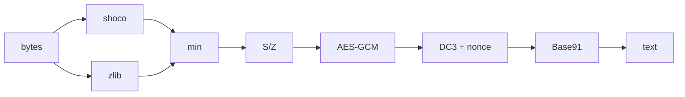
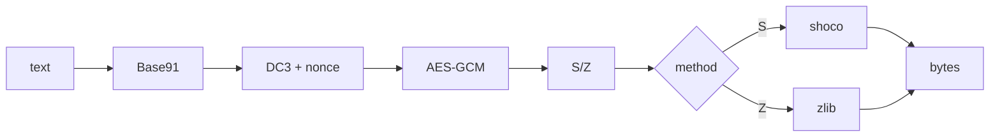

# text-serdes

Tiny daily-key text transport for copy/paste workflows.

`text-serdes` takes bytes from a file or stdin, compresses them with a pure-Python shoco port, encrypts them with an AES-GCM key derived from today's local date, Base91-encodes the result, and prints one copyable line.

It is built for short-lived engineering text: Python error messages, logs, paths, JSON/YAML/TOML fragments, shell commands, tracebacks, and other structured text that does not behave like long prose.

## Install

```bash
uv sync
```

Or install it as a `uv` tool from this checkout:

```bash
uv tool install .
```

## Use

Encode stdin:

```bash
printf 'TypeError: invalid literal for int()' | uv run enc
```

Decode stdin:

```bash
uv run enc message.txt | uv run dec
```

Encode a file:

```bash
uv run enc message.txt
```

Decode a file containing encoded text:

```bash
uv run dec encoded.txt
```

Both commands use one optional positional file. With no file, they read stdin until EOF. `enc` writes a newline-terminated encoded string. `dec` writes the original bytes to stdout.

## Format

Current payloads use:

- `DC3` magic
- random 12-byte AES-GCM nonce
- one encrypted method byte: `S` for shoco or `Z` for zlib
- the smaller of shoco-compressed or zlib-compressed plaintext
- AES-GCM authentication tag
- Base91 outer encoding

Older `DC2` shoco and `DC1` zlib payloads still decode, so same-day strings produced before compressor changes are not stranded.

Encode:



Decode:



## Security Model

This is not long-term secure storage.

The encryption key is:

```text
sha256(local-date-as-YYYY-MM-DD)
```

That means encoded output is intended to be decoded on the same local date. Anyone who knows the date can derive the key. Use this for short-lived transport convenience, not secrets that need real key management.

## Compression

The encoder tries both shoco and zlib, then stores whichever result is smaller. Shoco is a pure-Python port of a small-string compressor originally written in C. In the local benchmark corpus, shoco beat zlib on short engineering strings, while zlib beat shoco on repetitive 1-2KB samples:

```text
samples: 32
totals: raw=7947 zlib=2789 gzip=3173 shoco=6572 best=2345
total ratios: zlib=0.35x gzip=0.40x shoco=0.83x best=0.30x
median ratios: zlib=1.08x shoco=0.81x best=0.79x
wins vs current zlib: shoco=27 zlib=5 ties=0
```

Representative rows:

| sample kind | raw | zlib | gzip | shoco | best |
| --- | ---: | ---: | ---: | ---: | ---: |
| `TypeError: 'NoneType' object...` | 49 | 55 | 67 | 44 | 44 |
| `ModuleNotFoundError: No module...` | 49 | 54 | 66 | 36 | 36 |
| `ValueError: invalid literal...` | 57 | 64 | 76 | 44 | 44 |
| traceback path | 84 | 80 | 92 | 63 | 63 |
| JSON event | 85 | 81 | 93 | 69 | 69 |
| YAML deployment fragment | 67 | 73 | 85 | 51 | 51 |
| INI settings | 41 | 49 | 61 | 31 | 31 |
| source path | 53 | 49 | 61 | 36 | 36 |
| URL with query string | 73 | 76 | 88 | 55 | 55 |
| shell command | 55 | 63 | 75 | 46 | 46 |
| structured log line | 78 | 81 | 93 | 61 | 61 |
| UUID | 36 | 43 | 55 | 36 | 36 |
| SHA-256 digest | 71 | 65 | 77 | 70 | 65 |
| repeated traceback block | 1131 | 187 | 199 | 867 | 187 |
| repeated log block | 1764 | 267 | 279 | 1549 | 267 |
| repeated JSON block | 1776 | 286 | 298 | 1461 | 286 |
| repeated YAML block | 1576 | 227 | 239 | 1312 | 227 |

Practical read: shoco is good for the short strings this tool mostly targets. If you paste a long repeated log/blob, zlib has a much better ratio, so the encoder now picks zlib for those cases.

Run the comparison:

```bash
python scripts/compare_shoco.py
```

## Develop

```bash
uv run pytest -q
```

Useful files:

- `src/text_serdes/cli.py`: CLI entry points.
- `src/text_serdes/codec.py`: encode/decode pipeline.
- `src/text_serdes/shoco.py`: pure-Python shoco implementation.
- `scripts/compare_shoco.py`: compression comparison corpus.
- `docs/pure-python-shoco-notes.md`: notes for publishing the shoco port as a standalone PyPI package.
